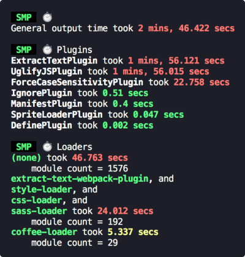

The credit for this package goes miles and miles to <a href="https://github.com/stephencookdev/speed-measure-webpack-plugin" target="_blank" >Stephen Cook - Speed Measure Webpack Plugin</a>. The only work of mine is to migrate it to Webpack v5 and adding an option to exclude certain plugins in the `wrap` config.

<div align="center">
  
  <h1>
    Speed Measure Plugin
    <div><sup><em>(for Webpack v5)</em></sup></div>
  </h1>

</div>
<br>

The first step to optimising your webpack build speed, is to know where to focus your attention.

This plugin measures your webpack build speed, giving an output like this:



## Install

```bash
npm install --save-dev speed-measure-webpack-v5-plugin
```

or

```bash
yarn add -D speed-measure-webpack-v5-plugin
```

## Requirements

SMP requires at least **Node v6**. But otherwise, accepts **all webpack** versions (1, 2, 3, and 4).

## Usage

Change your webpack config from

```javascript
const webpackConfig = {
  plugins: [new MyPlugin(), new MyOtherPlugin()],
};
```

to

```javascript
const SpeedMeasurePlugin = require("speed-measure-webpack-v5-plugin");

const smp = new SpeedMeasurePlugin();

const webpackConfig = smp.wrap({
  plugins: [new MyPlugin(), new MyOtherPlugin()],
});
```

and you're done! SMP will now be printing timing output to the console by default.

But if you choose to integrate it within your script all the time, you may face the following:
- The build fails at the end (in case of prod)
- Some plugin features such as HMR in react don't work.

To resolve this, you would have to exclude these plugins from the meassure (<a>Learn more about why it happens</a>):
Just you can do by passing an optional array parameter of the name of the plugin class to exclude.

For example, to exlcude, ReactRefreshPlugin and MiniCSSExtractPlugin send the list as:

```javascript
smp.wrap(config, ['ReactRefreshPlugin', 'MiniCSSExtractPlugin'])
```

And voila! You are now free to use this in production.

Check out the [examples folder](/examples) for some more examples.

## Options

Pass these into the constructor, as an object:

```javascript
const smp = new SpeedMeasurePlugin(options);
```

### `options.disable`

Type: `Boolean`<br>
Default: `false`

If truthy, this plugin does nothing at all.

`{ disable: !process.env.MEASURE }` allows opt-in measurements with `MEASURE=true npm run build`.

### `options.outputFormat`

Type: `String|Function`<br>
Default: `"human"`

Determines in what format this plugin prints its measurements

- `"json"` - produces a JSON blob
- `"human"` - produces a human readable output
- `"humanVerbose"` - produces a more verbose version of the human readable output
- If a function, it will call the function with the JSON blob, and output the response

### `options.outputTarget`

Type: `String|Function`<br>
Default: `console.log`

- If a string, it specifies the path to a file to output to.
- If a function, it will call the function with the output as the first parameter

### `options.pluginNames`

Type: `Object`<br>
Default: `{}`

By default, SMP derives plugin names through `plugin.constructor.name`. For some
plugins this doesn't work (or you may want to override this default). This option
takes an object of `pluginName: PluginConstructor`, e.g.

```javascript
const uglify = new UglifyJSPlugin();
const smp = new SpeedMeasurePlugin({
  pluginNames: {
    customUglifyName: uglify,
  },
});

const webpackConfig = smp.wrap({
  plugins: [uglify],
});
```

### `options.loaderTopFiles`

Type: `Number`<br>
Default: `0`

You can configure SMP to include the files that take the most time per loader, when using `outputFormat: 'humanVerbose'`. E.g., to show the top 10 files per loader:

```javascript
const smp = new SpeedMeasurePlugin({
  outputFormat: "humanVerbose",
  loaderTopFiles: 10,
});
```

### `options.compareLoadersBuild`

Type: `Object`<br>
Default: `{}`

This option gives you a comparison over time of the module count and time spent, per loader. This option provides more data when `outputFormat: "humanVerbose"`.

Given a required `filePath` to store the build information, this option allows you to compare differences to your codebase over time. E.g.

```javascript
const smp = new SpeedMeasurePlugin({
  compareLoadersBuild: {
    filePath: "./buildInfo.json",
  },
});
```

### `options.granularLoaderData` _(experimental)_

Type: `Boolean`<br>
Default: `false`

By default, SMP measures loaders in groups. If truthy, this plugin will give per-loader timing information.

This flag is _experimental_. Some loaders will have inaccurate results:

- loaders using separate processes (e.g. `thread-loader`)
- loaders emitting file output (e.g. `file-loader`)

We will find solutions to these issues before removing the _(experimental)_ flag on this option.

## FAQ

### What does general output time mean?

This tends to be down to webpack reading in from the file-system, but in general it's anything outside of what SMP can actually measure.

### What does modules without loaders mean?

It means vanilla JS files, which webpack can handle out of the box.

## Contributing

Contributors are welcome! 😊

Please check out the [CONTRIBUTING.md](./CONTRIBUTING.md).

## License

[MIT](/LICENSE)
